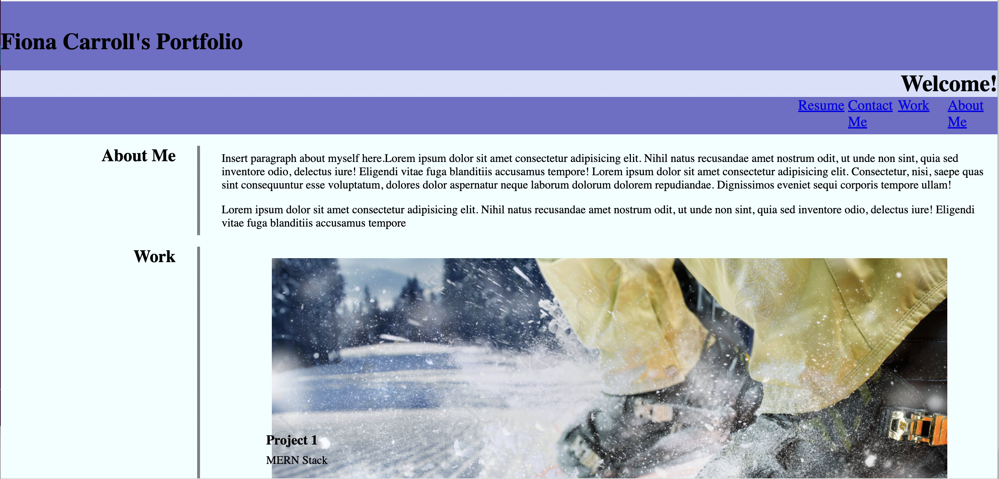
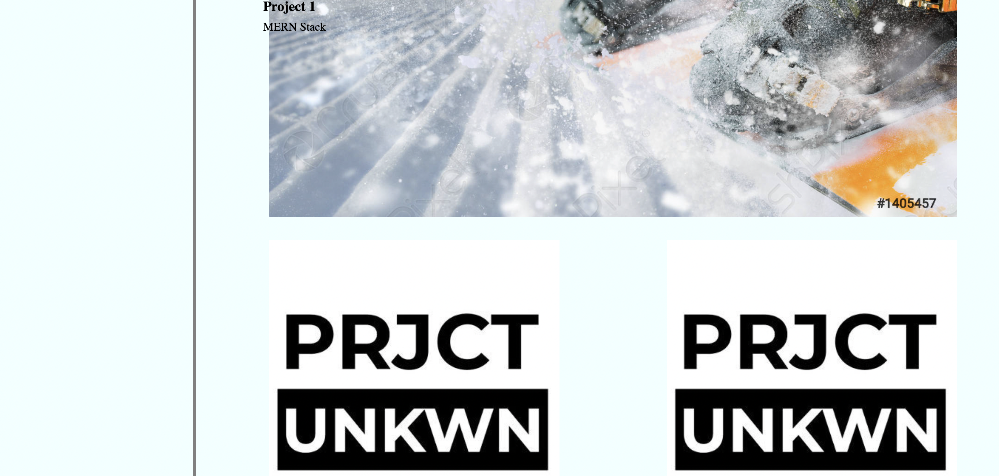
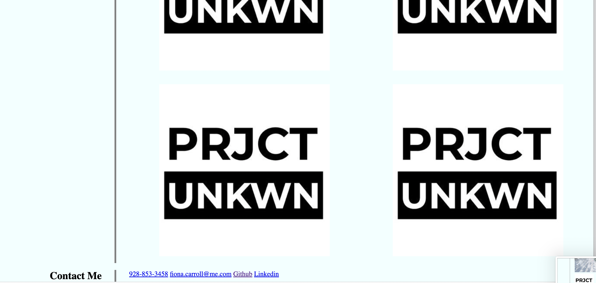

# fiona-carroll-professional-portfolio
## Description


I created this Professional Portfolio so I have a platform to display my future work and become more employable for future job prospects. I also created it so I have one single platform whereas I can upload work to showcase my skills. While the webpage isn't fully finished and I struggled in numerous styling aspects, I have a basic layout that I can refer to and work on further. I learned a lot more about CSS and HTML by getting to do a lot of solo hands-on work and research, and began developing some important skills and basics. 


## Usage

    ```md
    
    ```
md

md

md

## Credits

Link to github portfolio: https://github.com/fcarroll12/fiona-carroll-professional-portfolio

Link to deployed webpage: https://fcarroll12.github.io/fiona-carroll-professional-portfolio/

