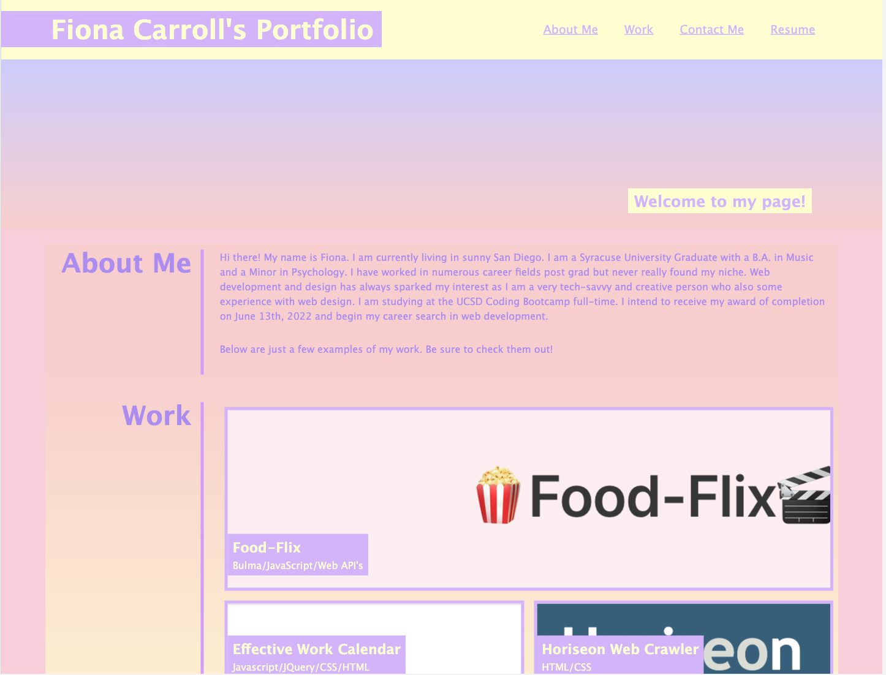

# fiona-carroll-professional-portfolio
## Description


I created this Professional Portfolio so I have a platform to display my future work and become more employable for future job prospects. I also created it so I have one single platform whereas I can upload work to showcase my skills. This webpage showcases basic skills in CSS and HTML and will be used to further add future projects to. I am struggling with providing a direct link to my work when you hover over the image. For now, you may access all my work through my GitHub Profile located at the bottom of my page.


## Usage

    ```md
    
    ```
md


## Credits

Link to github portfolio: https://github.com/fcarroll12/fiona-carroll-professional-portfolio

Link to deployed webpage: https://fcarroll12.github.io/fiona-carroll-professional-portfolio/

